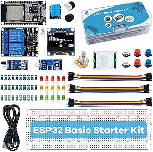
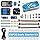
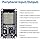
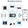

# LAFVIN ESP32 Basic Starter Kit Datasheet

## Product Overview

| Property | Value |
|----------|-------|
| **Product Name** | LAFVIN Basic Starter Kit for ESP32 ESP-32S WiFi IoT Development Board |
| **Brand** | LAFVIN |
| **Model** | ESP32 (ESP-32S) |
| **ASIN** | B0BVZBTP8V |
| **Price** | $19.99 |
| **Rating** | 4.5/5 stars (212 reviews) |
| **Date First Available** | February 16, 2023 |

---

## Product Images

### Main Product Image



### Additional Views

|  |  |
|-------------------------------------|-------------------------------------|
|  |  |
|  |                                     |

---

## Technical Specifications

### Hardware

| Specification | Details |
|--------------|---------|
| **Processor** | Espressif ESP32 |
| **CPU** | Dual-core 32-bit |
| **Connectivity** | Wi-Fi, Bluetooth |
| **RAM** | LPDDR2 |
| **Operating System** | Linux |
| **Item Weight** | 10.6 oz (300g) |
| **Dimensions** | 5.51 x 3.35 x 1.42 inches |

### Power

| Specification | Details |
|--------------|---------|
| **Power Input** | Micro USB (5V) |
| **Logic Voltage** | 3.3V |

---

## What's Included

### Main Components

| Item | Quantity |
|------|----------|
| ESP32 Development Board | 1 |
| 0.96" OLED Display | 1 |
| 830 Tie-Points Breadboard | 1 |
| Micro USB Cable | 1 |

### Sensors & Modules

| Item | Quantity |
|------|----------|
| Obstacle Avoidance Module | 1 |
| Photosensitive Resistor Module | 1 |
| DHT11 Temperature & Humidity Module | 1 |
| HC-SR501 PIR Motion Sensor | 1 |
| 5V 2-Channel Relay Module | 1 |

### Passive Components

| Item | Quantity |
|------|----------|
| Resistors (220R) | 10 |
| Resistors (1K) | 10 |
| Resistors (10K) | 10 |
| Potentiometer (10K) | 1 |
| Passive Buzzer | 1 |
| Active Buzzer | 1 |
| Button Switch | 6 |
| LED (Red) | 5 |
| LED (Yellow) | 5 |
| LED (Green) | 5 |
| RGB LED | 2 |

### Cables & Connectors

| Item | Quantity |
|------|----------|
| Male-to-Female Dupont Cable | 10 |
| Female-to-Female Dupont Cable | 10 |
| Male-to-Male Dupont Cable | 10 |

---

## Features

- Perfect for beginners learning electronics and programming
- Easy to use with introductory-level programming tutorials
- ESP32 modules can control LEDs, DHT11, OLED modules, and more
- Includes comprehensive tutorial with code and lessons
- Compatible with Arduino IDE

---

## Pinout

```
ESP32 Dev Board Pinout (Typical)
=================================

Power:
  - 3.3V  (3.3V output)
  - 5V    (5V input from USB)
  - GND   (Ground)

GPIO:
  - GPIO 0-33 (Digital I/O)
  - ADC1     (ADC channels 0-7)
  - ADC2     (ADC channels 0-9)

Communication:
  - UART:    RX/GPIO3, TX/GPIO1
  - I2C:     SDA/GPIO21, SCL/GPIO22
  - SPI:     MOSI/GPIO23, MISO/GPIO19, SCK/GPIO18, CS/GPIO5

Special:
  - EN       (Reset)
  - GPIO0    (Boot mode / ADC2_CH1)
```

---

## Programming

### Arduino IDE Setup

1. Add ESP32 board URL to Arduino IDE:
   ```
   https://raw.githubusercontent.com/espressif/arduino-esp32/gh-pages/package_esp32_index.json
   ```

2. Install ESP32 board package via Board Manager

3. Select appropriate board (e.g., "ESP32 Dev Module")

4. Configure upload settings:
   - Upload Speed: 115200
   - Flash Frequency: 80MHz

### MicroPython

Flash MicroPython to the ESP32 using esptool or mpremote:

```bash
esptool.py --chip esp32 --port /dev/ttyUSB0 erase_flash
esptool.py --chip esp32 --port /dev/ttyUSB0 --baud 460800 write_flash -z 0x1000 esp32-*.bin
```

---

## References

- **Amazon Product Page**: https://www.amazon.com/dp/B0BVZBTP8V
- **Espressif ESP32 Documentation**: https://docs.espressif.com/projects/esp-idf/
- **Arduino ESP32 Core**: https://github.com/espressif/arduino-esp32
- **MicroPython ESP32**: https://docs.micropython.org/en/latest/esp32/

---

*Document generated: March 2026*
