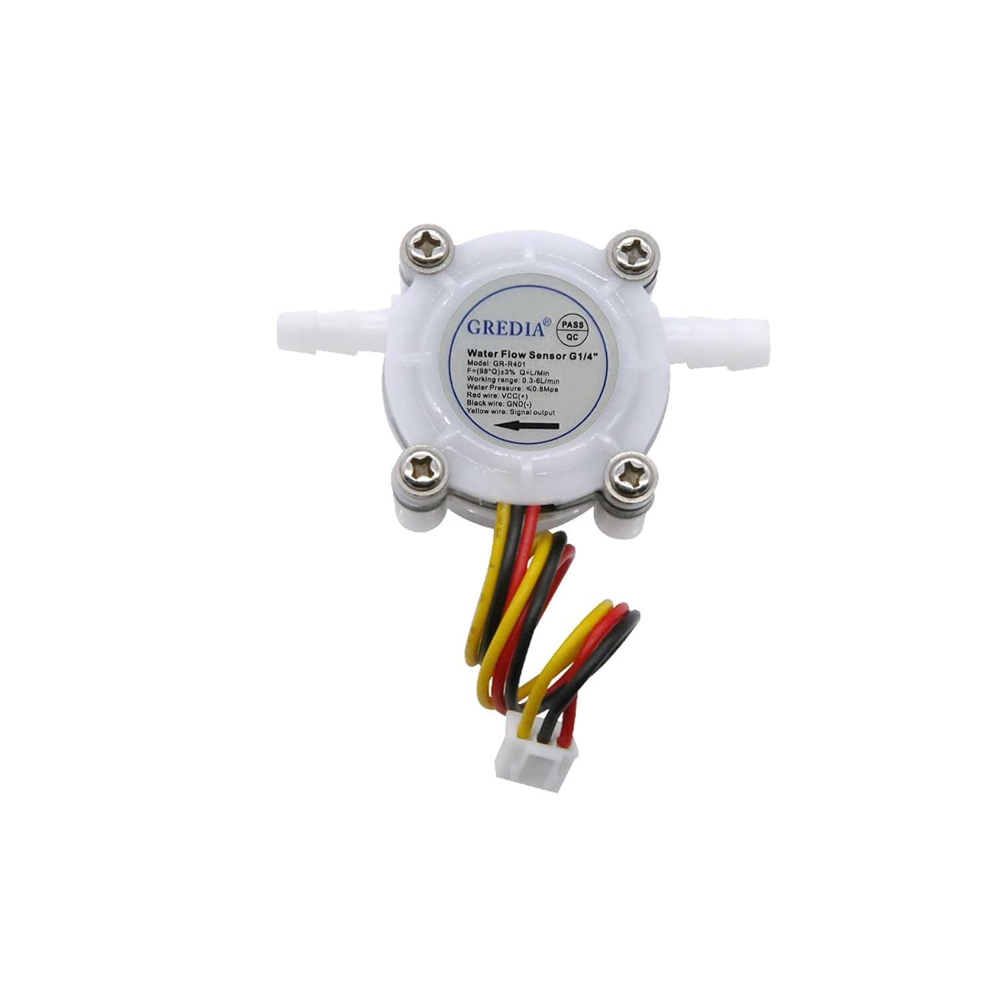

# GREDIA 1/4" Water Flow Sensor Data Sheet

## Product Overview

The GREDIA 1/4" Water Flow Sensor is a food-grade Hall effect flowmeter designed for precise liquid flow measurement in various applications. It features a compact design with reliable performance and easy installation.




---

## Key Features

- Food-grade plastic construction (ROHS compliant)
- Hall effect sensor technology
- Compact and lightweight design
- Easy installation with hosepipe connector
- Wide range of applications
- Reliable sealing to prevent leaks

---

## Technical Specifications

### Flow Characteristics

| Parameter | Value |
|-----------|-------|
| Flow Range | 0.3 - 6 L/min |
| Accuracy | ±3% |
| Pulse Output Formula | F = (98 × Q) ± 3% |
| | Where F = Frequency (Hz), Q = Flow rate (L/min) |

### Electrical Specifications

| Parameter | Value |
|-----------|-------|
| Working Voltage | DC 5V - 24V |
| Maximum Current | 10 mA (at DC 5V) |
| Output Type | Square wave pulse (open collector) |

### Physical Specifications

| Parameter | Value |
|-----------|-------|
| Dimensions (L × W × H) | 58 mm × 34 mm × 26 mm |
| Wire Length | 15 cm |
| Weight | 23 g (0.81 oz) |
| Connector Type | G1/4" hosepipe fitting |

### Environmental Specifications

| Parameter | Value |
|-----------|-------|
| Liquid Temperature | 0°C - 100°C |
| Water Pressure | ≤ 0.8 MPa (116 PSI) |
| Working Environment | Indoor/Outdoor |

---

## Dimensions (mm)


---

## Wiring Diagram

| Wire Color | Function |
|------------|----------|
| Red | VCC (+) |
| Black | GND (-) |
| Yellow | Signal Output (Pulse) |

### Connection Example

```
+VCC (5-24V) ──────► [RED] ──────► Sensor VCC
GND ───────────────► [BLACK] ────► Sensor GND
Microcontroller ───► [YELLOW] ───► Signal/Interrupt Pin
                            └─────► Internal Pull-up Required (10kΩ to VCC)
```

---

## Output Signal

The sensor outputs a square wave signal where:
- **Frequency** is proportional to flow rate
- **Duty cycle**: Approximately 50%
- **Formula**: F = 98 × Q (Hz), where Q is flow in L/min

### Example Readings

| Flow Rate (L/min) | Pulse Frequency (Hz) |
|-------------------|---------------------|
| 0.3 | ~29 |
| 1.0 | ~98 |
| 2.0 | ~196 |
| 3.0 | ~294 |
| 5.0 | ~490 |
| 6.0 | ~588 |

---

## Performance Curve


The graph above shows the relationship between flow rate (L/min) and output frequency (Hz).

---

## Applications

- Water heaters
- Coffee machines
- Water purifiers / RO systems
- Drinking fountains
- Beverage dispensers
- Industrial equipment
- Laboratory instruments
- Agricultural irrigation
- HVAC systems

---

## Installation Guidelines

1. **Orientation**: Install with flow direction matching the arrow on the body
2. **Inlet/Outlet**: Ensure adequate straight pipe length before and after sensor
3. **Sealing**: Use appropriate thread seal tape for threaded connections
4. **Wiring**: Use shielded cable for distances > 1m
5. **Pull-up**: Ensure proper pull-up resistor on signal line (10kΩ typical)

---

## Package Contents

- 1 × G1/4" Water Flow Sensor (hosepipe version)
- 1 × Sealing ring

---

## Model Variants

| Model | Connector Type |
|-------|----------------|
| B07MY6XJKK | G1/4" hosepipe |
| B07MY76NCV | G1/4" male thread |
| B07MY6XXYN | G1/4" quick connect |
| B07MY652QC | G3/8" male thread |
| B07MY7H45V | G3/8" quick connect |

---

## Ordering Information

| Item | Value |
|------|-------|
| Brand | GREDIA |
| Model | GR-R401 |
| ASIN | B07MY6XJKK |
| Date Available | January 19, 2019 |

---

## Certifications

- ROHS Compliant
- Food-grade materials

---

## Typical Arduino Connection Code

```cpp
const int flowPin = 2;  // Interrupt pin
volatile int pulses = 0;
float flowRate = 0.0;

void setup() {
  Serial.begin(9600);
  pinMode(flowPin, INPUT_PULLUP);
  attachInterrupt(digitalPinToInterrupt(flowPin), countPulse, FALLING);
}

void loop() {
  pulses = 0;
  sei();
  delay(1000);
  cli();
  flowRate = pulses / 98.0;  // F = 98 * Q, so Q = F / 98
  Serial.print("Flow: ");
  Serial.print(flowRate);
  Serial.println(" L/min");
}

void countPulse() {
  pulses++;
}
```

---

**Document Version:** 1.0  
**Date:** March 2026  
**Source:** Amazon Product Page (ASIN: B07MY6XJKK)
